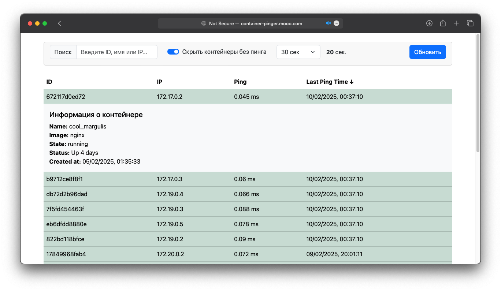

# container-pinger

[🔗 Live demo](http://container-pinger.mooo.com)



## О проекте

**Container Pinger** – это приложение, написанное на Go и TypeScript, которое:
- Получает IP-адреса Docker-контейнеров.
- Пингует их с заданным интервалом.
- Сохраняет результаты пинга в базу данных.
- Отображает актуальное состояние контейнеров на динамически формируемой веб-странице.

### Архитектура


## Установка и запуск

### Предварительные требования

- [Docker](https://www.docker.com/) и [Docker Compose](https://docs.docker.com/compose/) должны быть установлены на компьютере.

### Шаги по установке

1. Клонирование репозитория:

   ```bash
   % git clone https://github.com/jeorji/container-pinger.git
   ```

2. Переход в каталог проекта:

   ```bash
   % cd container-pinger
   ```

3. Создание файла конфигурации:

   Скопируйте файл `.env.example` в `.env` и отредактируйте переменные окружения при необходимости:

   ```bash
   container-pinger % cp .env.example .env
   ```

4. Запуск контейнеров:

   ```bash
   container-pinger % docker compose up
   ```

   Контейнеры будут собраны и запущены.

5. Доступ к приложению:

   После успешного запуска, приложение будет доступно по адресу: http://127.0.0.1
